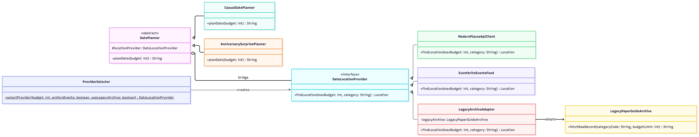

Date Concierge Engine (Assignment 3)

A romantic date planning service for couples in Astana. The architecture combines the **Bridge** and **Adapter** design patterns alongside a dynamic provider selection module.
1. Problem Domain
   The system helps users plan date scenarios (e.g., casual evening dates or anniversary surprises) based on a specified budget by querying different location and event providers across the city.

2. Design Rationale: Why Bridge + Adapter Together?

* **Why Bridge alone is not enough:**
  We have a legacy paper guide archive (`LegacyPaperGuideArchive`) with a completely incompatible interface. Bridge requires all concrete implementations to strictly implement the `DateLocationProvider` interface. Without an Adapter, we cannot integrate this legacy class without modifying its original source code.

* **Why Adapter alone is not enough:**
  An Adapter only wraps a single incompatible class to fit an interface. However, it does not prevent a combinatorial explosion of subclasses when adding new date planner types (e.g., Casual, Anniversary, VIP) and new location sources. Bridge decouples the high-level planning logic from the location sources so both hierarchies can grow independently.

3. Incompatibility Bar of `LegacyPaperGuideArchive`

The legacy archive class is genuinely incompatible for three reasons:
1. **Different parameter order and types:** Its method expects `(String categoryCode, int budgetLimit)` instead of `(int maxBudget, String category)`.
2. **Different return type:** It returns a raw semicolon-separated string (`"Name;Category;Rating"`) instead of a structured `Location` object.
3. **Different error handling:** It returns `null` or throws raw exceptions on failure. `LegacyArchiveAdapter` catches these and translates them into a domain-specific `LocationProviderException`.

4. Complexity Module: Dynamic Implementor Selection

Implemented in `ProviderSelector`, this module dynamically selects the appropriate `DateLocationProvider` (including the adapted legacy archive) at runtime based on the client's input budget and preferences, avoiding hard-coded dependencies on the client side.
5. Limitation of the Design

The selection logic in `ProviderSelector` relies on conditional `if/else` checks. If 10+ new providers are added in the future, the selector class will become cluttered. This could be refactored later using a Service Registry map or the Strategy pattern.
## 6. UML Class Diagram

7. How to Run
* **Run Unit Tests:** `mvn test`
* **Run Main:** `mvn compile exec:java -Dexec.mainClass="com.romance.engine.Main"`
